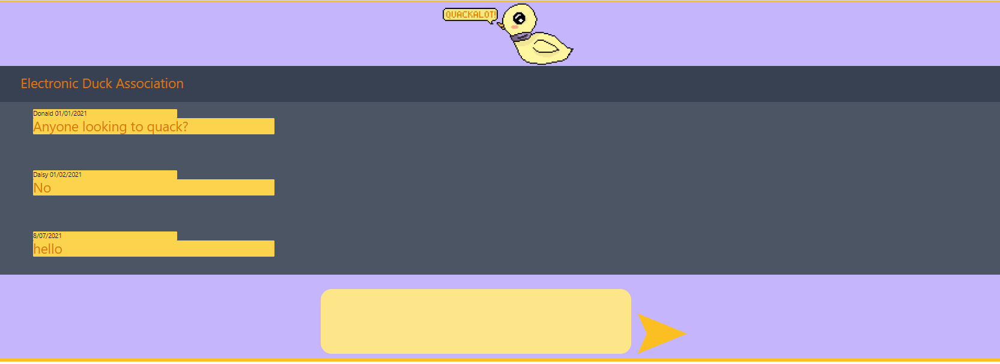
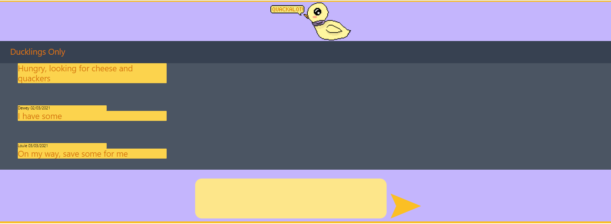

# Quack A Lot!

This is the first one day group project that we've done at Dev Academy. Quack A Lot is a website that has the looks of a chat rooms app but it's not actually one, the main purpose of creating this website was to practice creating routes using ExpressJS and Java Script.

Users can enter chat rooms by clicking on them, then type in a message and submit it. The message will show up on the chat screen with the date that it was submitted.

### From the command line

```bash
npm install # to install dependencies
npm run dev # to start the dev server
```

You can find the server running on [http://localhost:3000](http://localhost:3000).

## User interface

Home Page|
------------------------------------|
|

Chat Room One Page|Chat Room Two Page
------------------------------------|------------------------------
|


## Details

## Tech Stack
**Client:** JavaScript, HTML, CSS

**Server:** NodeJS, ExpressJS


## Authors
- Nicolas Hayvice-Caballe - [@nicolashayvice3](https://github.com/nicolashayvice3)

- Sina Kakhki - [@sina-kakhki](https://github.com/sina-kakhki)

- Yuan - [@jonathan-zhou](https://github.com/jonathan-zhou)

- Johann Besas - [@johannbesas](https://github.com/johannbesas)

- Rebecca Hallas [@rebecca-hallas](https://github.com/rebecca-hallas)
